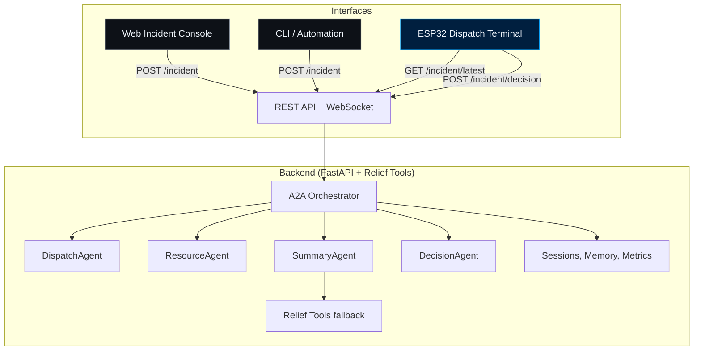
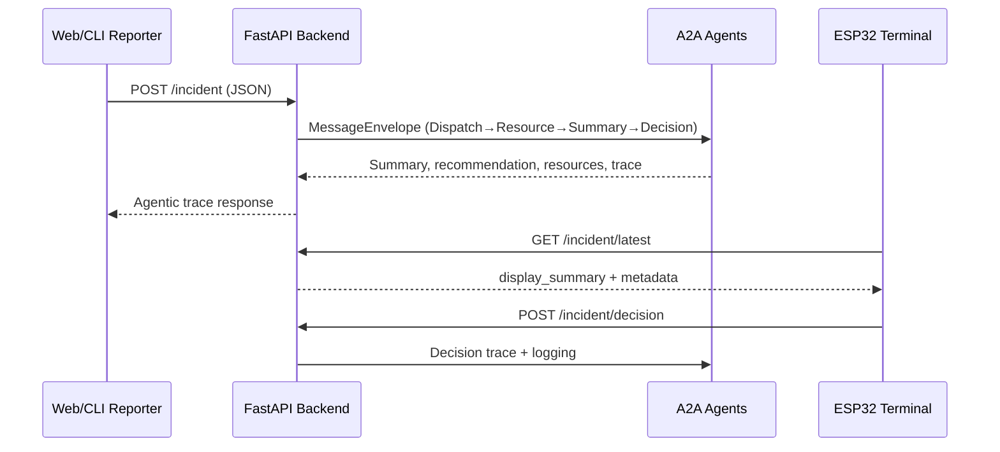

# Dispatch UI Agentic Capstone


## Project Overview

Dispatch UI is a cyber-physical dispatch system that demonstrates advanced agentic reasoning, multi-agent orchestration, and real-time hardware integration. It features:
- LLM-powered backend (FastAPI + Gemini)
- Multi-agent (A2A) pipeline: DispatchAgent, ResourceAgent, SummaryAgent, DecisionAgent
- ESP32 touchscreen terminal for real-time alerts and decisions
- Full session/memory, observability, and traceability

---

## Problem Statement

Emergency dispatch and resource allocation are high-stakes, time-sensitive tasks. Manual triage, resource matching, and communication with field units are error-prone and do not scale well. Human operators are often overwhelmed by information overload, leading to delays and suboptimal decisions.

---

## Solution Statement

ResQ-AI automates incident triage, resource recommendation, and concise alerting, freeing human operators to focus on critical judgment and oversight. The agentic pipeline ensures every step is explainable, observable, and extensible.

---


## Architecture



### Agentic Pipeline (A2A)
```mermaid
flowchart LR
    Incident[Incident Payload] --> DA[DispatchAgent (Gemini → fallback relief_tools)]
    DA --> RA[ResourceAgent (Gemini → relief_tools)]
    RA --> SA[SummaryAgent (Gemini-lite → formatter)]
    SA --> DCA[DecisionAgent]
    DCA --> Trace[Trace + Metrics]
    Trace --> UI[ESP32 + Web Interfaces]
```

---

## Workflow



---

## Directory Structure

```
dispatch-agent-capstone/
├── backend/
│   ├── .env
│   ├── requirements.txt
│   ├── server.py
│   ├── test_agents.py
│   ├── app/
│   │   ├── agents.py
│   │   ├── state.py
│   │   ├── relief_tools.py
│   │   └── ...
│   └── data/
├── hardware_client/
│   └── dispatch_ui/
│       ├── dispatch_ui.ino
│       └── secrets.h
└── docs/
    └── DOCUMENTATION.md
```

---

## Quickstart

### Backend (Python/FastAPI)
```sh
cd backend
pip install -r requirements.txt
uvicorn server:app --reload
```
- Edit `.env` with your Gemini API key.
- API runs at `http://localhost:8000` (or your LAN IP).

### Web Incident Console (Optional)
- `cd frontend && python -m http.server 8080` (or host with `http-server`)
- Visit `http://localhost:8080/incident_report.html`
- Enter your backend URL (default `http://localhost:8000`), fill out the form, and click **Submit Incident**

### Hardware Client (ESP32)
- Edit `secrets.h` with WiFi credentials **and** `BACKEND_URL`
- Flash `dispatch_ui.ino` to your ESP32.
- Tap the radar screen to force a poll; SEND/HOLD writes into history with full context.

---

## API Reference

- `POST /incident` — Add a new incident (returns full agentic trace)
- `GET /incident/latest` — Poll for latest incident (returns summary, recommendation, display_summary, resources, trace)
- `POST /incident/decision` — Send dispatcher decision (SEND/HOLD)

---

## UI Gallery

**Incident Web Console**


**ESP32 Radar Page**


**ESP32 Emergency Page**


**ESP32 History Page**


---


## Value Proposition

- **Real agentic reasoning:** All decisions are LLM-driven, not rule-based.
- **Cyber-physical integration:** Demonstrates end-to-end AI agent deployment from cloud to hardware.
- **Extensible:** Add more agents, tools, or hardware clients easily.
- **Traceable:** Every agentic step is logged and returned for audit/debugging.

---


## Credits

- Inspired by Google 5-Day AI Agents Intensive
- Built with FastAPI, Gemini, ESP32, LVGL/TFT_eSPI

---

## License

[Apache 2.0](LICENSE)
