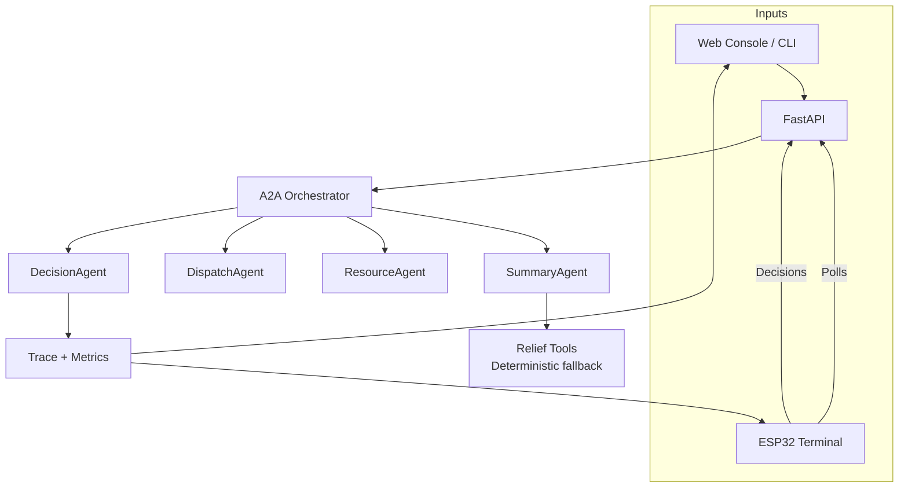
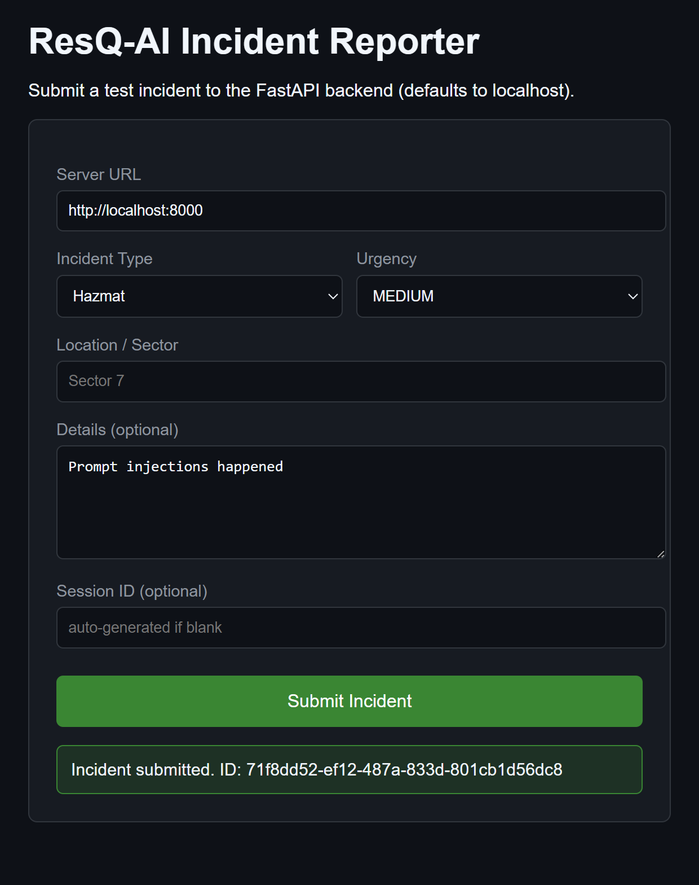
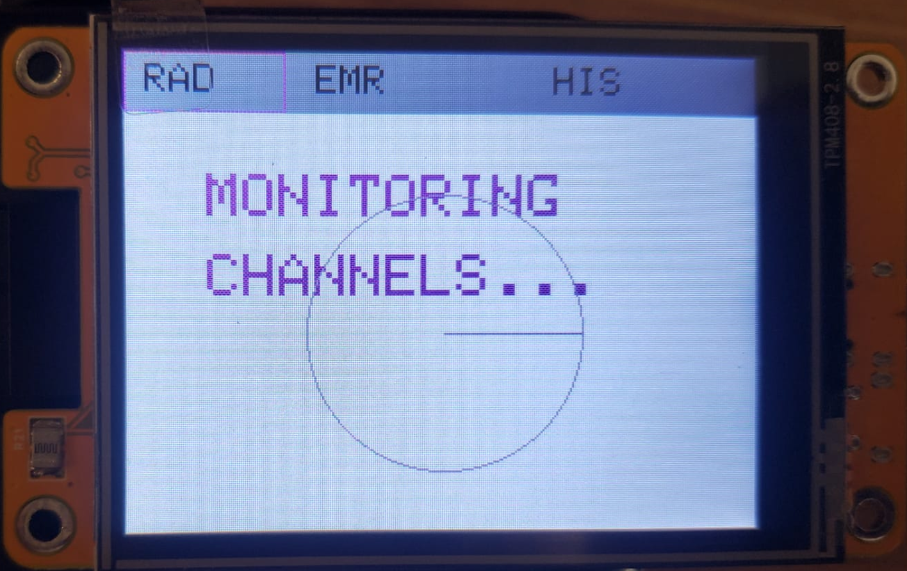
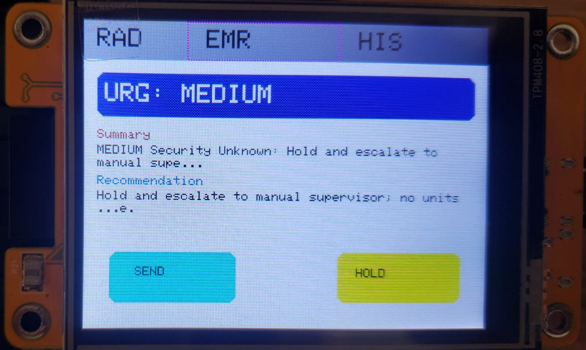
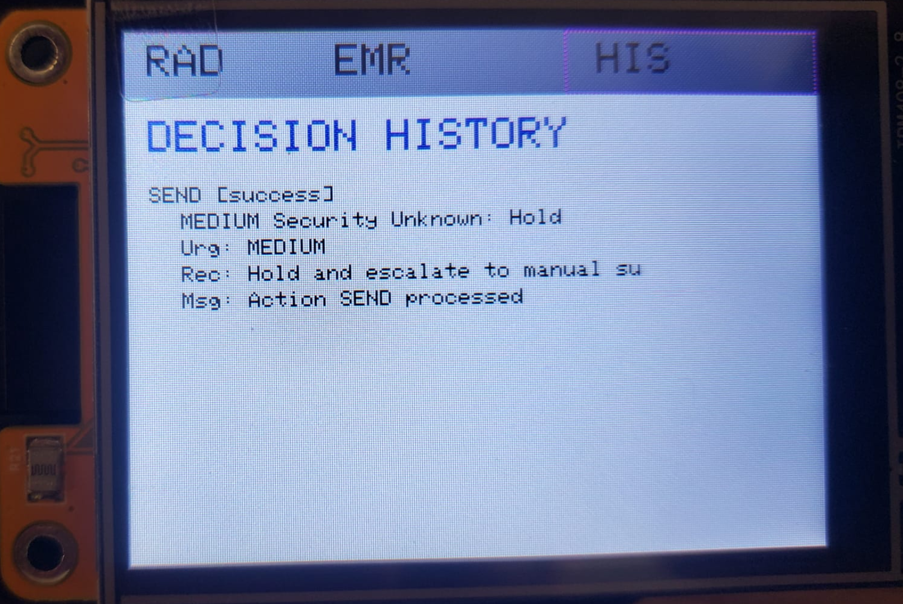

# Dispatch UI Agentic Capstone Documentation

## Table of Contents
- [Project Overview](#project-overview)
- [System Architecture](#system-architecture)
- [Backend (FastAPI + Gemini)](#backend-fastapi--gemini)
- [Hardware Client (ESP32)](#hardware-client-esp32)
- [Agentic Pipeline & A2A Architecture](#agentic-pipeline--a2a-architecture)
- [API Reference](#api-reference)
- [Setup & Deployment](#setup--deployment)
- [Troubleshooting](#troubleshooting)
- [Extending the System](#extending-the-system)
- [Credits](#credits)

---

## Project Overview
Dispatch UI is a cyber-physical dispatch system that demonstrates advanced agentic reasoning, multi-agent orchestration, and real-time hardware integration. It features:
- LLM-powered backend (FastAPI + Gemini)
- Multi-agent (A2A) pipeline: DispatchAgent, ResourceAgent, SummaryAgent, DecisionAgent
- ESP32 touchscreen terminal for real-time alerts and decisions
- Full session/memory, observability, and traceability

---

## System Architecture
- **Backend:** Python FastAPI server with CORS-enabled REST endpoints, orchestrator, state, and deterministic relief-tool fallbacks.
- **Agents:** Dispatch, Resource, Summary, and Decision agents operate through the A2A MessageEnvelope pipeline (Gemini-first, graceful fallback).
- **Interfaces:** 
  - Web Incident Console (`frontend/incident_report.html`) for ad‑hoc submissions.
  - CLI / automation scripts (e.g., PowerShell `Invoke-WebRequest` or `curl`).
  - ESP32 touchscreen terminal (radar, emergency, history views) for polling and decisions.

---

## Backend (FastAPI + Gemini)
- Located in `backend/`
- Key files: `server.py`, `app/agents.py`, `app/state.py`, `app/relief_tools.py`
- Uses Google Gemini LLM for all reasoning and recommendations
- `.env` file stores API keys and secrets

---

## Hardware Client (ESP32)
- Located in `hardware_client/dispatch_ui/`
- Key files: `dispatch_ui.ino`, `secrets.h`
- Connects to WiFi, polls backend, displays incidents, and handles SEND/HOLD decisions
- Robust UI: debounced buttons, null safety, user feedback for errors

---

## Agentic Pipeline & A2A Architecture
- **MessageEnvelope:** Structured message object passed between agents
- **A2AOrchestrator:** Chains agents, logs trace, enables advanced agentic flows
- **Agents:**
  - `DispatchAgent`: Summarizes incident, recommends action
  - `ResourceAgent`: Allocates resources, provides resource summary
  - `SummaryAgent`: Generates concise display summary for UI
  - `DecisionAgent`: Handles SEND/HOLD/queue management and logs decisions
- **Traceability:** Every agent step is logged and returned in API responses

### Agentic Pipeline (A2A) - Mermaid Diagram

---

## API Reference
- `POST /incident` — Add a new incident (returns full agentic trace)
- `GET /incident/latest` — Poll for latest incident (returns summary, recommendation, display_summary, resources, trace)
- `POST /incident/decision` — Send dispatcher decision (SEND/HOLD)

---

## Setup & Deployment
### Backend
1. `cd backend`
2. `pip install -r requirements.txt`
3. Edit `.env` with your Gemini API key
4. `uvicorn server:app --reload`

### Hardware Client
1. Edit `secrets.h` with WiFi credentials **and** `BACKEND_URL`
2. Flash `dispatch_ui.ino` to ESP32
3. Tap radar to force new poll; SEND/HOLD decisions are logged in history

---

## Troubleshooting
- **ESP32 can't connect:** Check backend IP, WiFi, and firewall
- **API errors:** Check backend logs and `.env` configuration
- **Null/empty fields:** UI will display fallback messages, check backend agent outputs

---

## Extending the System
- Add new agents by subclassing and registering in the orchestrator
- Add new endpoints or UI features as needed
- All agentic logic is LLM-driven and easily extensible

---

## User Interfaces

**Web Incident Console**

**ESP32 Radar Page**

**ESP32 Emergency Page**

**ESP32 History Page**

Feel free to reuse these assets in reports or presentations.

---

## Credits
- Inspired by Google 5-Day AI Agents Intensive
- Built with FastAPI, Gemini, ESP32, LVGL/TFT_eSPI

---

For more, see the main [README.md](./README.md).
